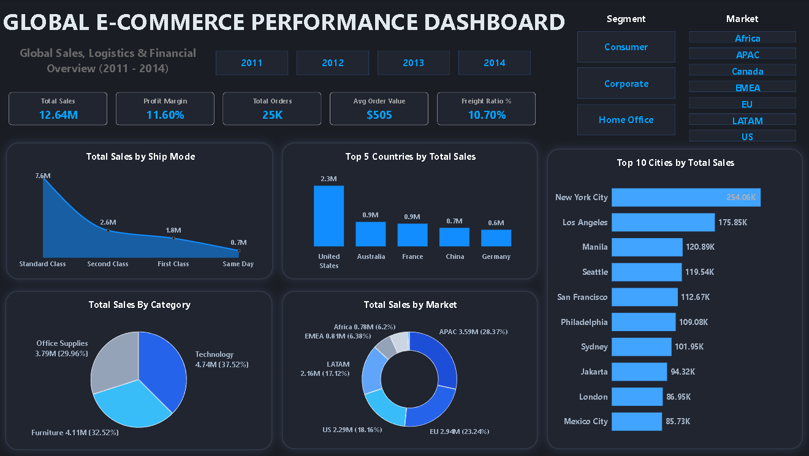
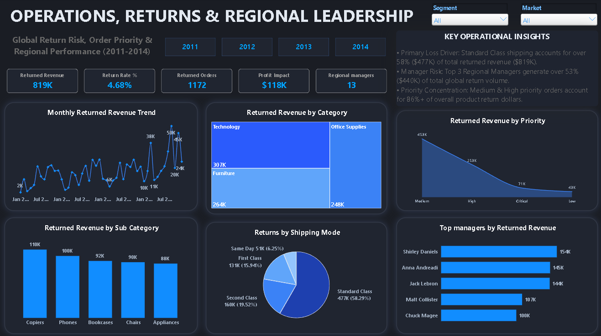

## Dashboard Preview

### Dashboard – Page 1

### Dashboard – Page 2

## 🌍 Global E-Commerce Performance Dashboard

An interactive Power BI report built to analyze global e-commerce sales, logistics, and returns performance — covering **51,000+ orders** across **7 markets** and **4 years (2011–2014)**, with a focus on profitability, shipping efficiency, and return risk.

## Short Description

The **Global E-Commerce Performance Dashboard** is a two-page Power BI report designed to help stakeholders track sales and profitability trends while identifying where operational losses — specifically returns and freight cost — are coming from. It combines a sales/logistics overview with a dedicated operations and returns-risk page, giving both a high-level financial snapshot and a drill-down into what's driving losses. The tool is intended for e-commerce operations managers, regional sales leadership, and business analysts who need to turn raw order-level data into shipping and returns decisions.

## Tech Stack

The dashboard was built using the following tools and technologies:

- **📊 Power BI Desktop** — Main data visualization and report-building platform.
- **📂 Power Query** — Data cleaning and transformation layer for shaping the raw Orders, Returns, and People tables before modeling.
- **🧠 DAX (Data Analysis Expressions)** — Used to build calculated measures including Profit Margin %, Freight Ratio %, Return Rate %, and Average Order Value.
- **📝 Data Modeling** — Star-schema-style relationships across three tables (**Orders**, **Returns**, **People**) to support cross-filtering by Segment, Market, and Year.
- **📁 File Format** — `.pbix` for development, `.xlsx` for the source dataset, `.pdf`/`.png` for dashboard previews.

## Data Source

*Source: Global Superstore e-commerce order dataset.*

The dataset contains order-level records for **51,290 orders**, including order and ship dates, ship mode, customer segment, product category/sub-category, sales, profit, shipping cost, and order priority — spanning 7 global markets (US, Canada, LATAM, EU, EMEA, APAC, Africa). A companion **Returns** table (1,174 records) flags returned orders by market, and a **People** table maps each region to its regional manager.

## Features / Highlights

- **Business Problem**

  E-commerce businesses generate large volumes of order data, but sales dashboards alone rarely explain *why* profitability erodes. Questions like:

  - Which shipping mode is driving the most returns and lost revenue?
  - Which regions and managers carry the highest return risk?
  - Is profit being eaten by freight cost, discounting, or returns?

  ...are hard to answer from raw transactional data without a purpose-built report.

- **Goal of the Dashboard**

  To deliver a two-page interactive report that:
  - Gives leadership a fast read on total sales, profit margin, and order volume by year, segment, and market.
  - Isolates the operational cost of returns — by category, shipping mode, priority, and regional manager.
  - Supports decisions on shipping-mode policy, regional accountability, and category-level risk management.

- **Walkthrough of Key Visuals**

  **Page 1 — Sales, Logistics & Financial Overview**
  - **Key KPIs (Top):** Total Sales **12.64M** · Profit Margin **11.60%** · Total Orders **25K** · Avg Order Value **$505** · Freight Ratio **10.70%**
  - **Segment & Market Filter Panel:** Slicers for Consumer/Corporate/Home Office and for all 7 markets, cross-filtering every visual on the page.
  - **Total Sales by Ship Mode (Area Chart):** Shows Standard Class dominating volume at 7.6M, far ahead of Second Class, First Class, and Same Day.
  - **Total Sales by Category (Pie Chart):** Technology leads at 4.74M (37.5%), followed by Furniture (32.5%) and Office Supplies (30.0%).
  - **Top 5 Countries & Top 10 Cities by Total Sales (Bar Charts):** Ranks the US, Australia, France, China, and Germany, and drills further into top-performing cities like New York City and Los Angeles.
  - **Total Sales by Market (Donut Chart):** Breaks down the 12.64M in sales across APAC (28.4%), EU (23.2%), US (18.2%), LATAM (17.1%), EMEA (6.4%), and Africa (6.2%).

  **Page 2 — Operations, Returns & Regional Leadership**
  - **Key KPIs (Top):** Returned Revenue **819K** · Return Rate **4.68%** · Returned Orders **1,172** · Profit Impact **$118K** · Regional Managers **13**
  - **Monthly Returned Revenue Trend (Line Chart):** Tracks return-driven revenue loss from 2011–2014, highlighting a sharp spike in returns during 2014.
  - **Returned Revenue by Category (Treemap):** Technology (307K) is the largest source of returned revenue, ahead of Furniture (264K) and Office Supplies (248K).
  - **Returned Revenue by Priority (Area Chart):** Medium- and High-priority orders account for the large majority of return dollars.
  - **Returns by Shipping Mode (Pie Chart):** Standard Class alone accounts for 58.3% ($477K) of all returned revenue.
  - **Top Managers by Returned Revenue (Bar Chart):** Ranks the 5 regional managers with the highest exposure to returns, led by Shirley Daniels ($154K).

- **Business Impact & Insights**

  - **Primary Loss Driver:** Standard Class shipping accounts for over **58% ($477K)** of total returned revenue ($819K) — a strong signal that shipping-mode policy is worth revisiting for return-prone categories.
  - **Manager Risk Concentration:** The top 3 regional managers generate over **53% ($440K)** of total global return volume, pointing to specific regions that need process review.
  - **Priority Concentration:** Medium and High priority orders account for **86%+** of overall product return dollars, suggesting fulfillment speed/priority handling may be linked to return likelihood.
  - **Category Risk:** Technology drives both the highest sales (4.74M) and the highest returned revenue (307K), making it the category with the most profit volatility.
